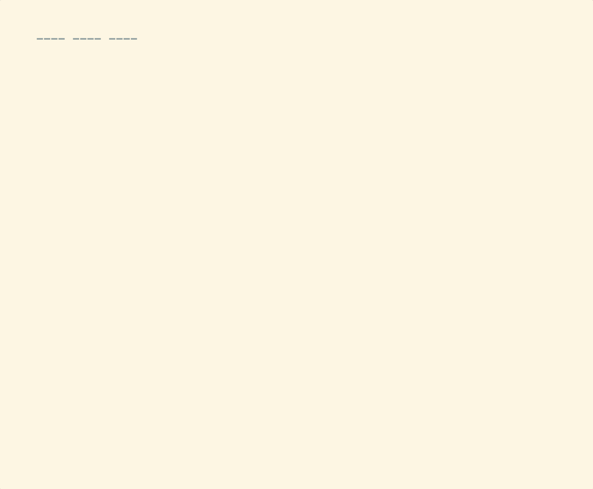

# claude-config

Modular configs for Claude Code, tmux, neovim, and more.



## Install

```bash
git clone https://github.com/quickcall-dev/claude-config.git
cd claude-config

# Interactive — pick what you want
./install.sh

# Or install specific modules
./install.sh statusline tmux nvim
```

Each module can also be installed standalone:

```bash
./statusline/install.sh
./tmux/install.sh
./nvim/install.sh
```

## Modules

| Module | What it does |
|--------|-------------|
| **statusline** | Status bar + turn counter for Claude Code |
| **tmux** | Tmux config, TPM, vim nav, system clipboard, editor integration |
| **nvim** | Neovim config with Lazy, treesitter, telescope, file explorer |

## Statusline preview

```
my-project • main* • Opus 4.6 • [█░░░░░░░] 5% • T12
```

Directory, git branch, model, context usage, and turn count. Turns change color as sessions get longer: cyan (T1-19), yellow (T20-29), red (T30+).

## Requirements

macOS or Linux, [jq](https://jqlang.github.io/jq/) (for statusline), [Claude Code](https://docs.anthropic.com/en/docs/claude-code)

## Adding a new module

Create a directory with an `install.sh` inside it. The root installer auto-discovers it.
